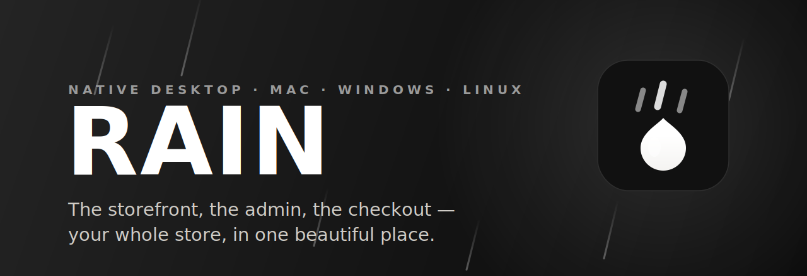
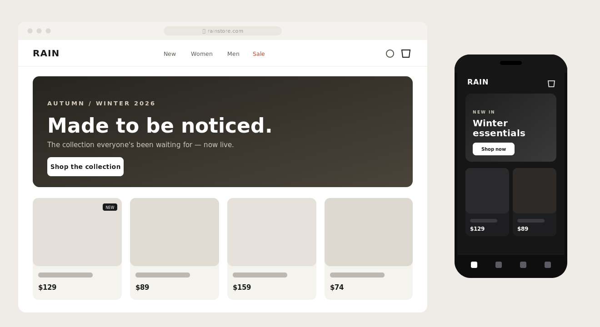
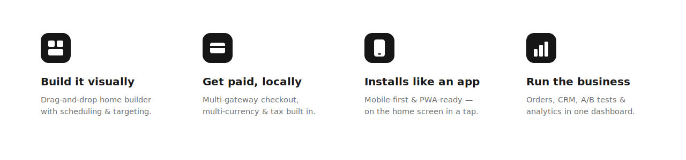
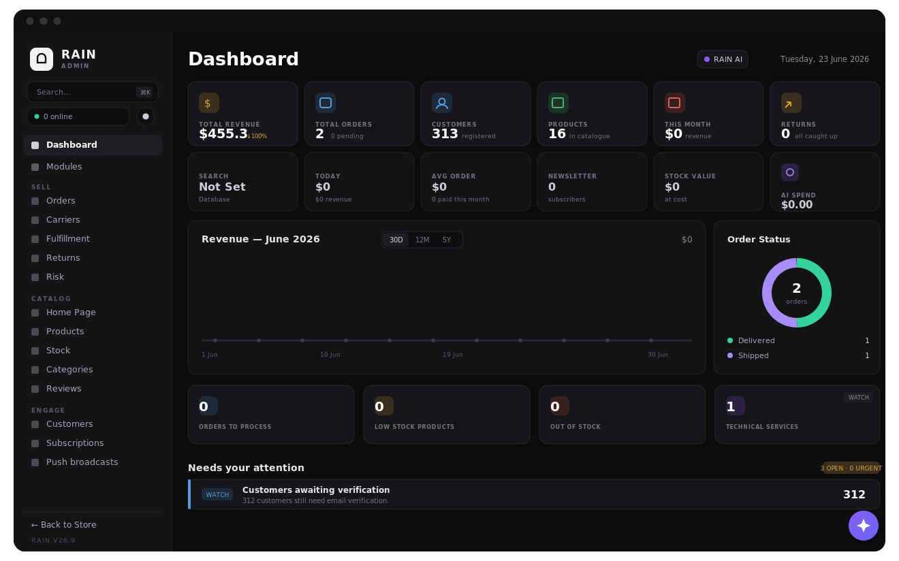
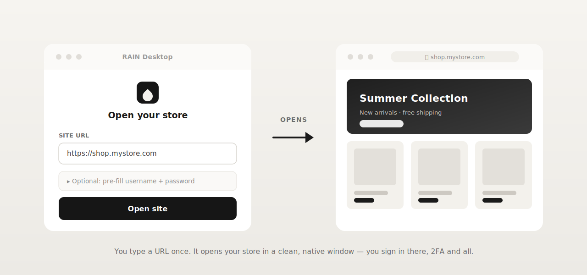
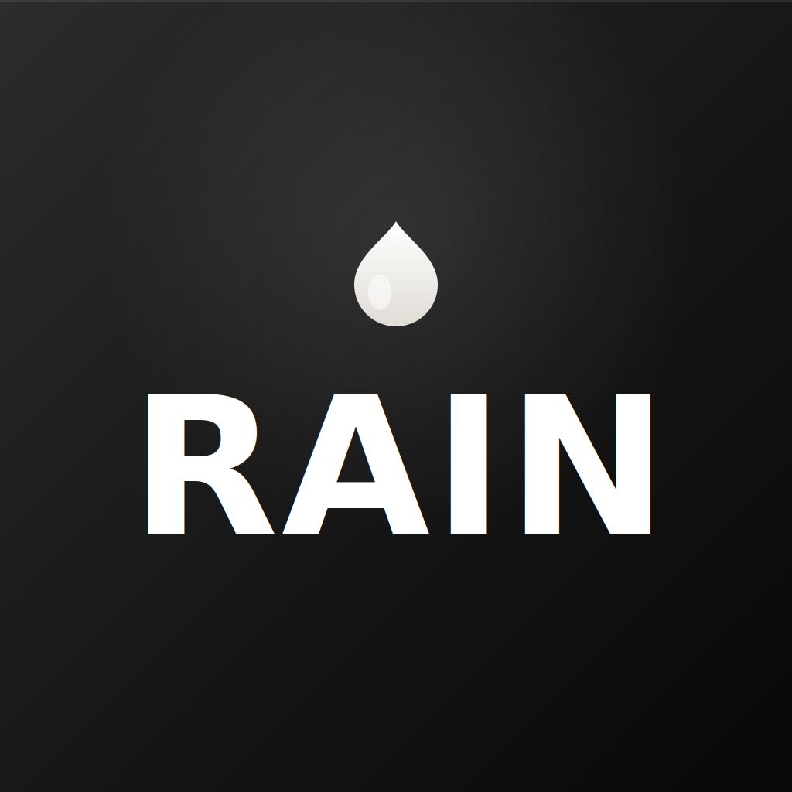

<!-- ───────────────────────────  RAIN  ─────────────────────────── -->

<p align="center">
  
</p>

<p align="center">
  <a href="../../releases"></a>
  <a href="../../releases"></a>
  <a href="../../releases"></a>
  
  
  <a href="LICENSE"></a>
</p>

<h3 align="center">The most beautiful way to run an online store — now a native app on your desktop.</h3>

<p align="center">
  <b>RAIN</b> is the commerce platform the web has been waiting for: a storefront customers
  fall in love with, a back-office that runs the whole business, and a checkout that simply
  closes the sale.<br/>
  And this is its companion <b>native desktop app</b> — <b>Mac, Windows, and Linux</b> — your
  entire store, one click from the dock. <b>Nothing else looks, feels, or sells like it.</b>
</p>

<p align="center">
  <a href="https://mrzakaria.com/rain-store"><b>✦  Visit the RAIN store</b></a>
  &nbsp;·&nbsp;
  <a href="../../releases"><b>⬇  Download for Mac · Windows · Linux</b></a>
  &nbsp;·&nbsp;
  <a href="#-how-the-desktop-app-works">How it works</a>
</p>

<br/>

---

## ✦ Meet RAIN — commerce, beautifully done

Some stores just look *built*. **RAIN** looks **crafted.**

It's a complete, modern commerce platform — fast where it counts, elegant where it shows, and
relentless about turning visitors into orders. Everything it takes to sell online, and nothing
you have to fight with. A storefront your customers fall for on their phones. An admin you
actually *enjoy* opening. A checkout that closes the sale instead of losing it.

No plugins to babysit. No theme that breaks on the next update. Just one beautifully engineered
store that feels premium from the first tap to the thank-you page.

<p align="center"><a href="https://mrzakaria.com/rain-store"><b>✦  See RAIN live  →  mrzakaria.com/rain-store</b></a></p>

<p align="center">
  
</p>
<p align="center"><sub><b>What your shoppers see.</b> A storefront so good they forget they're shopping — pixel-perfect on desktop and phone, light and dark, every single time.</sub></p>

<br/>

<p align="center">
  
</p>

### 🎨 A storefront that sells
- **Drag-and-drop home builder** — compose your homepage from rich widgets (heroes, carousels, spotlights, parallax, personalized rows) with **scheduling, audience, and per-device targeting** baked in.
- **Mobile-first by design** — product cards, shop, cart, and a **sticky checkout CTA** tuned for thumbs, with a polished dark mode.
- **Installs like an app** — full **PWA** support and a one-tap install prompt put your store on the home screen.

### 💳 A checkout that converts
- **Multi-gateway payments** — built to plug into local and global processors (CMI and friends), so customers pay the way they trust.
- **Multi-currency & tax** — decimal-safe rounding and tax reporting that hold up to the accountant.
- **Order tracking** — signed-in shoppers see their orders **auto-load** with live tracking; everyone else can track by number.

### 📊 A back-office that runs the business
- **One dashboard** for orders, customers (CRM), and fulfillment.
- **Grow on evidence** — A/B testing, AI assists, SEO & competitor analytics, and a ⌘K command palette.
- **Sleep at night** — system monitoring, a public status page, uptime guards, and admin **IP allow-listing**.

<p align="center">
  
</p>
<p align="center"><sub><b>Where you run the empire.</b> Revenue, orders, customers, stock, traffic, and AI — one calm, beautiful command center that surfaces exactly what needs you, and quietly handles the rest.</sub></p>

<br/>

---

## ✦ Why nothing else comes close

We didn't build *another* store builder. We built the one that makes the rest feel dated —
an app like the web hasn't seen before, beautiful enough to show off and powerful enough to
run the whole business.

| | The usual store platforms | **RAIN** |
| --- | :---: | :---: |
| **Native desktop app** · Mac, Windows, Linux | a browser tab | **✅ a real app in your dock** |
| **Mobile experience** | a bolt-on theme | **✅ mobile-first + installable PWA** |
| **Build your homepage** | code, or rigid templates | **✅ drag-and-drop, scheduled & device-targeted** |
| **Local payment gateways** | limited, often extra fees | **✅ multi-gateway, built in** |
| **Multi-currency & tax** | paid add-ons | **✅ decimal-safe, built in** |
| **Grow on data** | basic reports | **✅ A/B · AI · SEO & competitor analytics · ⌘K** |
| **Your data & branding** | locked to their platform | **✅ end-to-end yours** |
| **Per-sale platform cut** | yes | **✅ none** |

One platform, every surface — **web, phone, and desktop**. Zero compromise.

<br/>

---

## 🖥 Your store, on every device

RAIN already lives on the **web** and installs as a **PWA** on phones. This repository adds the
final surface: a **true native desktop app** for **macOS, Windows, and Linux** — built on
[Tauri v2](https://tauri.app) (Rust + the system webview, ~5 MB, *not* Electron).

No browser tabs to hunt for. No bookmarks that get lost. Just your store, in the dock,
opening in a clean window where you sign in like normal — **password and 2FA included**.

<br/>

---

## ✦ How the desktop app works

<p align="center">
  
</p>

1. **Type your store URL once** — the launcher remembers it (and your recent stores), and shows
   your store's logo as you type.
2. **Optionally pre-fill** your username + password — stored *only on your device*, only if you opt in.
3. **Open** — your store loads in a focused native window. You finish signing in there,
   **2FA and all** — exactly like a browser, just without the browser.

> 🔒 **Your 2FA code is never stored or auto-typed.** You always enter it yourself, in the store window.

<br/>

---

## ⬇ Get the apps

<p align="center"></p>

Every file is named for exactly what it is — grab the one for your machine:

| Platform | Download | Who it's for |
| --- | --- | --- |
| **macOS — Apple Silicon** | `RAIN-Desktop-macOS-Apple-Silicon.dmg` | M1 / M2 / M3 / M4 Macs (2020+) |
| **macOS — Intel** | `RAIN-Desktop-macOS-Intel.dmg` | Intel Macs (pre-2020) |
| **Windows — x64** | `RAIN-Desktop-Windows-x64-Setup.exe`<br/>`RAIN-Desktop-Windows-x64.msi` | most Windows PCs |
| **Windows — ARM64** | `RAIN-Desktop-Windows-ARM64-Setup.exe`<br/>`RAIN-Desktop-Windows-ARM64.msi` | Surface Pro X, Snapdragon PCs |
| **Linux — x64** | `RAIN-Desktop-Linux-x64.AppImage`<br/>`RAIN-Desktop-Linux-x64.deb`<br/>`RAIN-Desktop-Linux-x64.rpm` | most desktops/servers |
| **Linux — ARM64** | `RAIN-Desktop-Linux-ARM64.AppImage`<br/>`RAIN-Desktop-Linux-ARM64.deb`<br/>`RAIN-Desktop-Linux-ARM64.rpm` | Raspberry Pi 4/5, ARM servers |

<sub><b>Windows:</b> <code>-Setup.exe</code> is the normal installer · <code>.msi</code> is for managed/enterprise rollouts.
<b>Linux:</b> <code>.AppImage</code> is portable (just <code>chmod +x</code> and run) · <code>.deb</code> for Debian/Ubuntu/Mint · <code>.rpm</code> for Fedora/RHEL/openSUSE.</sub>

<p align="center"><a href="../../releases/latest"><b>→ Download the latest release</b></a></p>

<p align="center"><sub>First launch on macOS/Windows shows a security prompt for unsigned apps — see <a href="SIGNING.md">SIGNING.md</a> to open it in one click (or sign &amp; notarize so it opens directly).</sub></p>

<br/>

---

<p align="center">
  <b>RAIN — your whole store, beautifully done.</b><br/>
  <sub>See it live, explore the platform, and make it your own.</sub>
</p>
<p align="center">
  <a href="https://mrzakaria.com/rain-store"><b>✦  Explore the RAIN store  →</b></a>
</p>

<br/>
<br/>

---

<!-- ════════════════════════════════════════════════════════════════
     EVERYTHING BELOW IS FOR OPERATORS & DEVELOPERS:
     how to point the app at your store, build it, and ship it.
     ════════════════════════════════════════════════════════════════ -->

# 🔌 Connect it to your store

> RAIN Desktop is a **launcher** — it contains **none** of the store's code. It simply opens a
> URL you choose in a native window. You need a running **RAIN store web app** for it to point at.

You can connect a store in two ways:

**A) At runtime (no rebuild)** — open the app, type your store URL (e.g.
`https://shop.yourbrand.com` or `https://admin.yourbrand.com`), and hit **Open site**. Done.

**B) Baked in at build time** — ship a build that already knows your URL:

```bash
npm run set-url -- https://admin.yourbrand.com
```

The launcher will pre-fill that URL on first run (it stays editable).

---

## Build all three OSes with one command — GitHub Actions

Cross-OS binaries **cannot** be compiled from a single machine, so the reliable
"one command, all 3 versions" path is CI:

1. Push this folder to a GitHub repo.
2. **Actions → build → Run workflow** → *(optionally)* type your default URL → **Run**.
3. When the three jobs finish, the installers are attached to a **draft Release**:
   macOS `.dmg`, Windows `.msi`/`.exe`, Linux `.deb`/`.AppImage`/`.rpm`.

Or **push a tag** to build and publish in one step:

```bash
git tag v0.1.0 && git push origin v0.1.0
```

The workflow auto-generates a placeholder icon if none is committed, so builds never fail.

---

## Build locally (one OS at a time)

Install once:
- **Rust ≥ 1.77** → https://rustup.rs
- **Node ≥ 18** + **npm**
- Tauri's per-OS system deps → https://tauri.app/start/prerequisites
  - **macOS:** Xcode Command Line Tools (`xcode-select --install`)
  - **Linux:** `libwebkit2gtk-4.1-dev librsvg2-dev libayatana-appindicator3-dev patchelf`
  - **Windows:** WebView2 runtime (preinstalled on Win 10/11) + MSVC Build Tools

Then:

```bash
cd rain-desktop
npm install
npm run icons                 # generate the icon set from app-icon.png
npm run set-url -- https://admin.yourbrand.com   # optional: bake a default URL
npm run dev                   # run live
npm run build                 # installers for THIS OS → src-tauri/target/release/bundle/
```

---

## Make it yours

| What | Where |
| --- | --- |
| App name / id / version | `src-tauri/tauri.conf.json` (`productName`, `identifier`, `version`) |
| Launcher window size | `app.windows[0]` in the same file |
| App icon | replace `app-icon.png` (1024×1024) and run `npm run icons` |
| Default URL at build time | `npm run set-url -- <url>` (or the CI input) |
| Login-field matching | the selector list in `build_prefill_script()` in `src-tauri/src/lib.rs` |

The branded artwork in `assets/` (icon, banner, diagrams) is plain SVG — edit and re-render with
`rsvg-convert` or any SVG tool.

---

## Layout

```
rain-desktop/
├─ assets/                  # branding & marketing art (SVG)
│  ├─ icon.svg · banner.svg · how-it-works.svg · features.svg
├─ app-icon.png             # 1024×1024 source for every platform icon
├─ src/                     # launcher UI (vanilla HTML/JS — no build step)
│  ├─ index.html · app.js · style.css
├─ src-tauri/               # the Tauri (Rust) app
│  ├─ src/lib.rs            # open_site command + credential pre-fill
│  ├─ tauri.conf.json       # windows, bundle targets (all OSes), identifier
│  └─ capabilities/default.json
├─ scripts/                 # set-default-url + placeholder-icon generators
├─ .github/workflows/build.yml   # cross-OS build → draft release
└─ package.json
```

---

## Security notes

- The loaded website runs in its **own window with no access to native commands** — only the
  local launcher window has IPC (see `capabilities/default.json`).
- The URL is validated (`https`/`http` only) before a window is opened.
- Pre-filled credentials live in the launcher's local storage **on your machine**, only when you
  opt in. For a hardened build, move them to the OS keychain via `tauri-plugin-stronghold` /
  `keyring` (left out to keep v1 dependency-free).
- **2FA is never stored or auto-entered.**

---

<p align="center">
  <sub>Built as the native companion to the <b><a href="https://mrzakaria.com/rain-store">RAIN store</a></b>. macOS · Windows · Linux installers come from the GitHub Actions workflow above. · MIT licensed.</sub>
</p>
